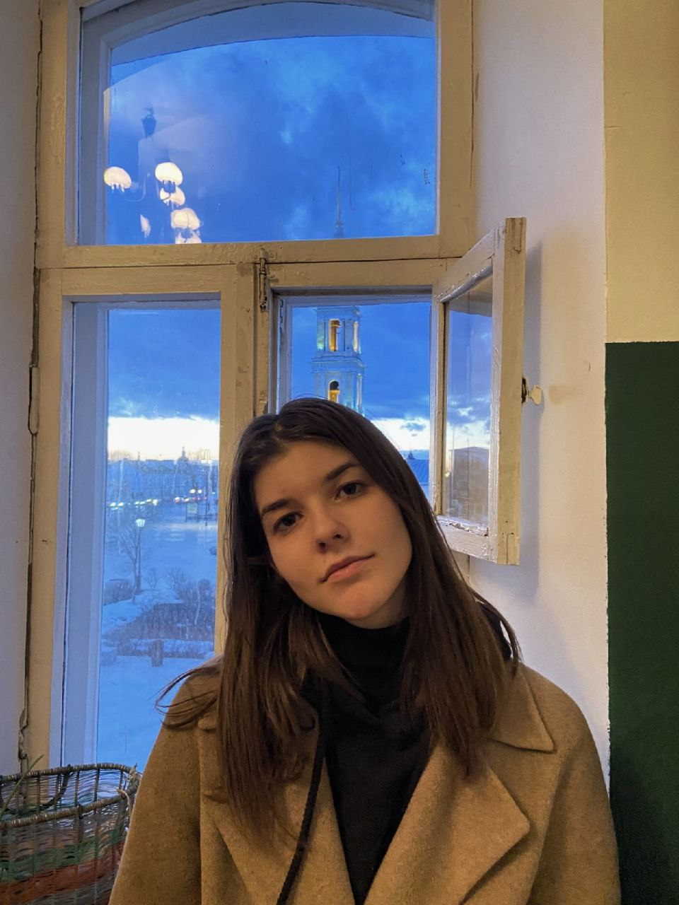

Graduate at Moscow State Linguistic University. Interests: linguistics, AI, chess, cats, tasty food ☕️

 
<!--  {% include button.html text="Tweet it" icon="twitter" link="https://twitter.com/intent/tweet/?url=https://alembic.darn.es&text=Alembic%20-%20A%20Jekyll%20boilerplate%20theme&via=DavidDarnes" color="#0d94e7" %}  -->
